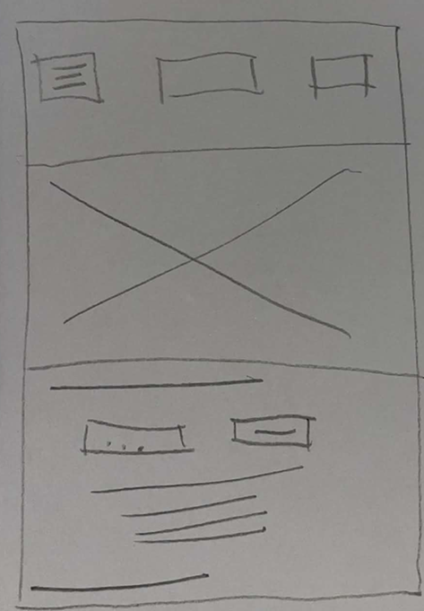

# Assignment 1: UX Design Report

- **Author**: David Matic
- **FAN**: mati0046
- **Student ID**: 2376989
- **Topic ID**: COMP1103

<!-- Create your UX Design Report in this file. -->

---

## Project Proposal Clarity and Feasibility

The core purpose of the animal shelter’s website is to facilitate the adoption of homeless pets. There should be more than one way to begin the adoption process of a pet as each animal needs to be accepted into a loving home. Therefore we use the website for different reasons: to have a list of all current animals that have not been adopted yet with information about each of them to help a potential adopter familiarize themselves with a pet potentially before visiting the shelter which opens up to a wider demographic as there could be people who are more inclined to view online rather than in-person, which tackles the potential problem of awareness. There might be an owner who has had a pet go missing and they would want to check shelter websites to see if they can find them which could help them a lot. The digital application process assists staff in identifying the most compatible environments for each animal, ensuring that pets are matched based on their specific behavioural and physical needs while maintaining an inclusive and fair review process for all applicants. With lots of easy-to-read and positive information, the website could be inviting and successful. 

## User Research and Personas

### **PACT Analysis Matrix**

| **PACT Items** | **PACT Content** |
| --- | --- |
| **People** | The users will be limited to three distinct groups: Adopter (main user), Employee (shelter worker), and Administrator (oversight of the system).   Physical Characteristics include a wide range of digital literacy levels, from tech-savvy young adopters to staff members who may struggle with complex interfaces. Vision requirements must be considered, ensuring high contrast for older users and those using mobile devices in bright outdoor shelter conditions. Users may also have limited motor precision if accessing the site on mobile devices while multitasking (e.g., a worker holding a leash in one hand while checking a pet's status with the other). |
| **Activities** | Adopters: Filtering by specific lifestyle needs (e.g., apartment-friendly), tracking real-time application status, and digital form submission.   Admins: High-frequency CRUD operations for pet profiles and application management. |
| **Context** | Physical: Modern home/office environments and high-glare outdoor shelter settings.   Social: A high-stakes, emotional journey; the system must foster trust through transparency and eliminate "administrative friction." |
| **Technology** | A dynamic website (10+ pages) with database integration for animal lists and application storage.   Requires search/filter functionality and secure admin login.    A 10+ page responsive web application.   Features: Complex relational database for pet/user matching, secure Admin CRUD portal, and a "Live" status engine to prevent ghost listings. |

### **User Persona**

## Information Architecture and User Flow

### **Sitemap**
The sitemap illustrates the hierarchical structure of the website, ensuring a logical flow from the landing page to the specific pet profiles and adoption forms.

### **User Flow Diagram**
This diagram maps out the specific path Matthew takes to achieve his goal: finding a high-energy but gentle dog and reaching the application form to submit his request at adopting a pet.

## Low-Fidelity Wireframes and Annotations

I used the 6-8-5 method to rapidly ideate eight different layouts for the landing page. My goal was to explore how different information hierarchies could solve Matthew’s need for a 'no dead-ends' experience while maintaining a high-impact visual appeal.  

I have selected Concept #7 because it prioritizes a direct search-to-result pipeline combined with proactive user engagement tools.

  
I have changed the concept that I will be using from #7 to this final version which will be called Concept #9. The reason is because with this latest sketch it allows for more options to be visible to the user at any given time, it looks cleaner and more modern and each functionality is easy to understand and straight forward.

### **Digital Wireframes**
Following the rapid ideation phase, I developed two high-detail digital wireframes in Figma to define the layout and functionality of the core pages. These designs prioritize accessibility and a clear path to conversion for the user.

### Home Page Wireframe

**Annotations:**
1. **Global Navigation:** Easy access to the Menu, Logo (Home), and Donation portal.
2. **Hero Search:** Large, accessible search bar to solve the user's primary intent immediately.
3. **Engagement CTA:** A "Click Here" link for users who prefer guided navigation over searching.
4. **Pet Grid:** A dynamic preview of available animals to provide immediate visual feedback.

### Pet Profile Page (Jolly)

**Annotations:**
1. **Breadcrumb/Identity:** Clear display of the pet's name to orient the user.
2. **Key Specs:** Tabulated data (Age, Gender, Breed) for quick grokkability.
3. **Narrative Description:** High-impact text to build an emotional connection with the adopter.
4. **Primary CTA:** High-contrast "Apply Now" button fixed toward the bottom for easy mobile thumb access.
