# Implementation Report: Happy Paws Animal Shelter
**Author:** David Matic (mati0046)  
**Date:** May 2026  
**Directory:** project-docs/src/A2/

I acknowledge the use of Claude AI (Anthropic, 2026) in the development of this submission. Claude was used to assist with coding, specifically partial PHP and JavaScript, with some debugging. All prompts and outputs are included in Appendix 1.

---

## 1. Website Functionality & Flow

### 1.1 Home Page (`index.php`)

**Annotations:**
1. **Horizontal Menu:** The reason for this menu style is because it brings simplicity to the website and with the users attention being directly at the center where the logo is, it creates ease of use. 
2. **Search Bar:** Large, accessible search bar to solve the user's primary intent immediately right inbetween all the content.
3. **Slideshow:** This slideshow is meant to show some of the animals that the shelter have. They can be searched for directly above in the search bar, or via the "Available Pets" menu option.
4. **Vertically stacked footer:** This is a very clean and clear way to handle all of the relevant information respective to the shelter; their phone number, address, etc. It is a common approach, brings an additional layer to the website and takes up some space. 

### 1.2 About Us (`about.html`)
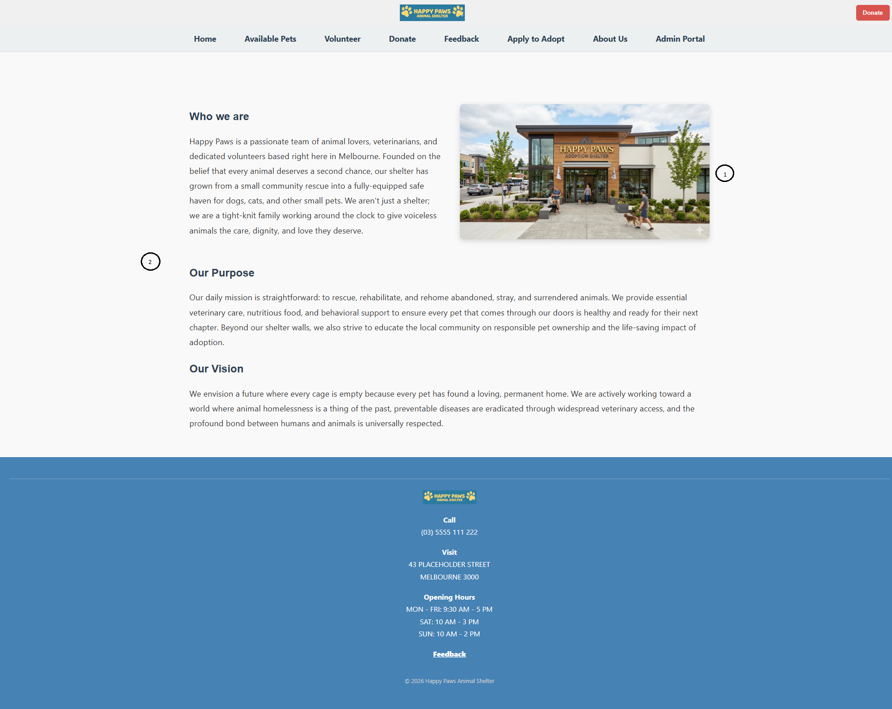

**Annotations:**
1. **Photo placement:** When you want to know about a company, place, area or so on, it is good to have a photo that is clearly visible in the "About" section. It is placed near the text while keeping nice clean vertical borders for tidiness. 
2. **Text blocks:** Large text blocks that are clearly separated. These were kept simple because nothing fancy needs to be added to a page where someone wants to get a brief and concise block of information about who the shelter is.

### 1.3 Available Pets (`adoption.php`)
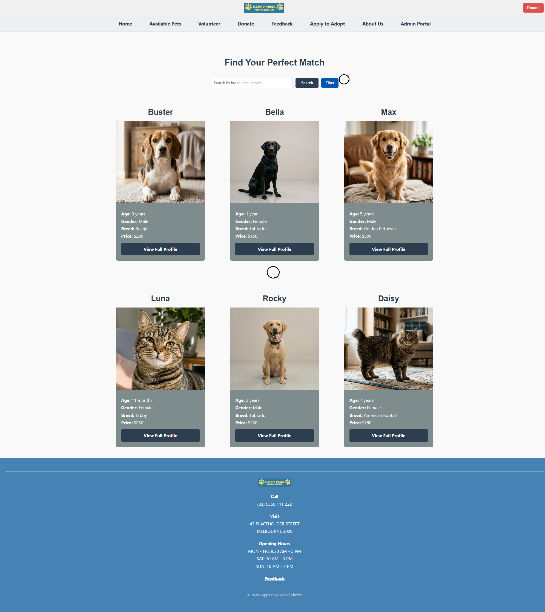

**Annotations:**
1. **Filter option:** This might be obsolete considering the search bar located in both the home page and adoption page but having more search options via a filter is good because a shelter might have dozens and dozens if not more pets so any sort of filtering option adds efficiency and precision. 
2. **Available Pets layout:** The reason for this layout is because it is neat, spacious and extremely easy to navigate. Neatly stacked rows and columns with a maximum of 3 animals per row and only several traits are visible to keep it compact.

### 1.4 Donate (`donate.php`)
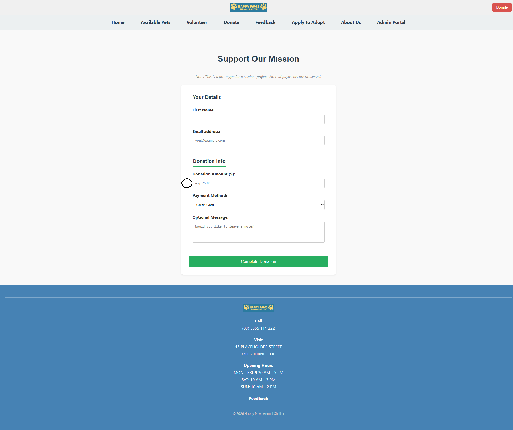

**Annotations:**
1. **Only valid payment amount allowed:** A straight forward donation form. When attempting to enter an invalid donation amount such as $0 or a negative value, an error pops up that must be corrected before proceeding with any donation.

### 1.5 Pet Details (`pet-details.php`)
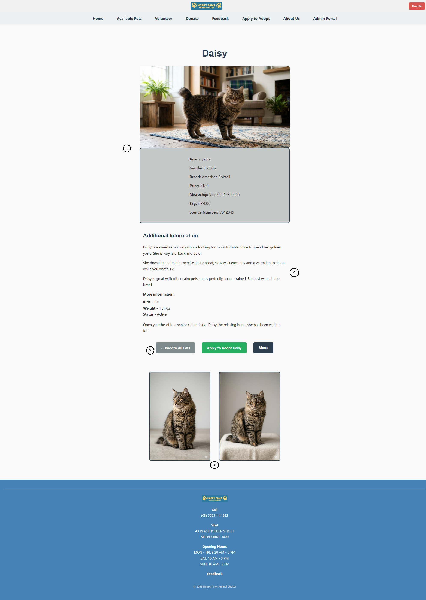

**Annotations:**
1. **Vertical animal information:** You want the potential adoptee to immediately see the animal they are looking at. With this layout completely centered with the information immediately eye-catching in the slightly darkened grey box, all the information is processed quickly. 
2. **Additional Information:** Providing all the required and relevant information necessary about the animal. Providing as much information as possible is good because the adoptee might feel as though they are already closer to the animal from knowing its history, potential traits, and what to expect.
3. **Buttons:** There were several locations these buttons could have been placed. I chose to place them below the animal/animal information because when adopting an animal, the animal and potential adoptee should both be granted the best fit. You do not want someone to skip through all of the information and simply press "Apply". At Happy Paws, we want what is best for the animal, and we want everyone who comes into the shelter to feel as though they can develop an immediate connection with a potential future pet.
4. **Additional images:** Finally at the bottom of the page, a few additional images of the animal can be seen. This is so that no matter where you are on the page, you can always see the animal you are currently looking at.

### 1.6 Apply to Adopt (`application.php`)
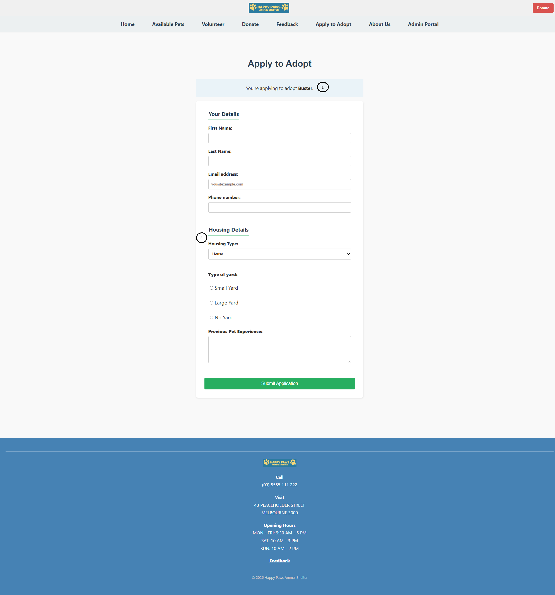

**Annotations:**
1. **Adoption Information:** When proceeding with an application, the user is informed on which animal they are currently trying to apply to adopt. This is to ensure no mistakes are made, such as accidental clicks on the wrong animal or just to confirm the animal they are trying to adopt. The approach is to ensure that every step of the way, the potential adoptee has all the relevant information necessary.
2. **Adoptee details:** For animal shelter workers, having a great range of information about a potential adoptee makes a huge difference. For example if a potential adoptee wants to adopt a very outgoing, excitable dog such as a French Bulldog, having a living environment that is potentially limiting or an adoptee with the complete opposite personality of that particular breed of dog might not be the best match -- not necessarily bad, but that is why the enquiry option exists aswell.

### 1.7 Feedback (`feedback.php`)
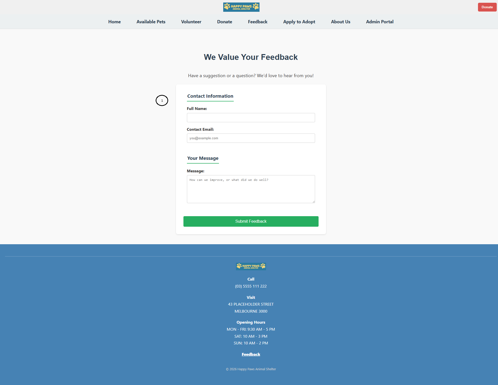

**Annotations:**
1. **Simplicity:** Having a simple and familiar form (as all forms on the website are similar) is both inviting and provides ease of use, which is important.

### 1.8 Admin Portal (`admin.php`)
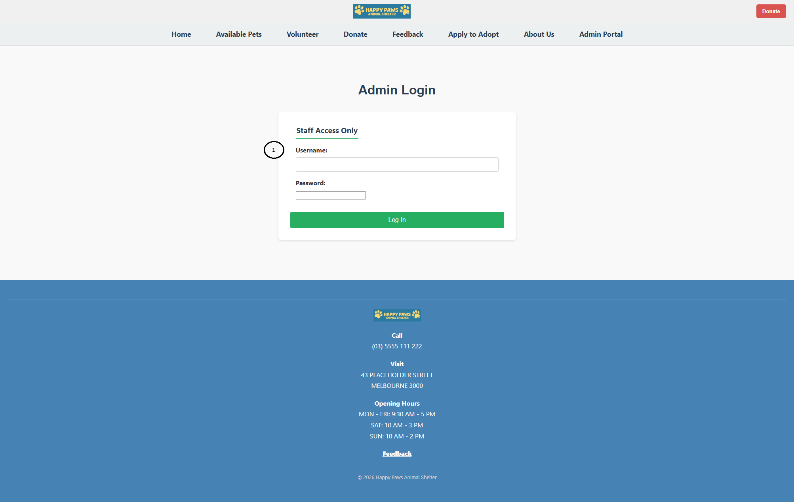

**Annotations:**
1. **Security:** The Admin Portal comes with security to ensure that only staff members are able to access the portal with a shared username and password. In a real world scenario, this typically would not be ideal as anyone could accidentally give away the password, especially with former employees but in a closeknit animal shelter, having a global username and password to simply add/edit/remove pets from the available selection is sufficient. An error message is displayed when entering the wrong username/password.

### 1.81 Admin Portal (`admin.php`)
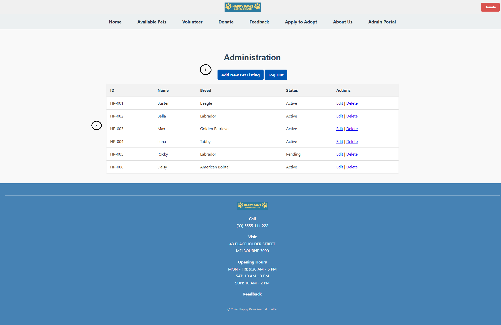

**Annotations:**
1. **Buttons:** There is an option to log out that way once a worker is signed in, the account is not stuck signed in so this also adds security. From there you can add a new pet listing with a button almost directly centered on the screen so it is extremely straight forward.
2. **Pet listings:** The Admin Portal features a list of every pet, trackable via ID and Name, with active status showing whether or not the pet is available. From there you can press Edit or Delete on any particular animal depending on the requirements.

### 1.9 Add Pet (`add_pet.php`)
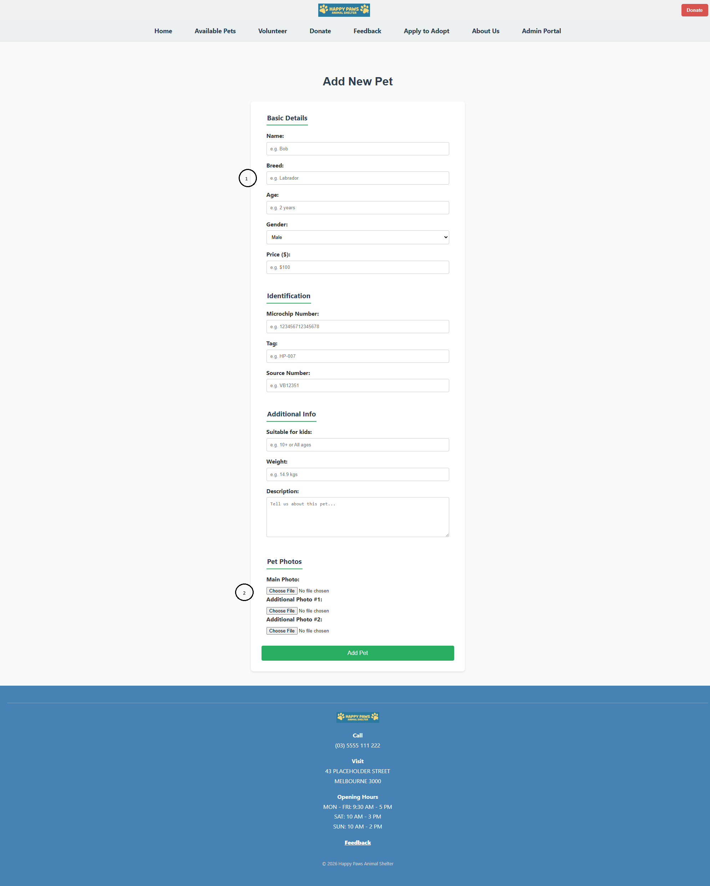

**Annotations:**
1. **Adding a pet into the system:** Every piece of information and trait of an animal can be entered, with complete guidance via the examples that are in each text box.
2. **Adding photos:** There is an entire section dedicated to adding the main photo which appears on the Adoption page, and then the two additional smaller photos which are in the specific page of a particular animal.

### 1.10 Edit Pet (`edit_pet.php`)
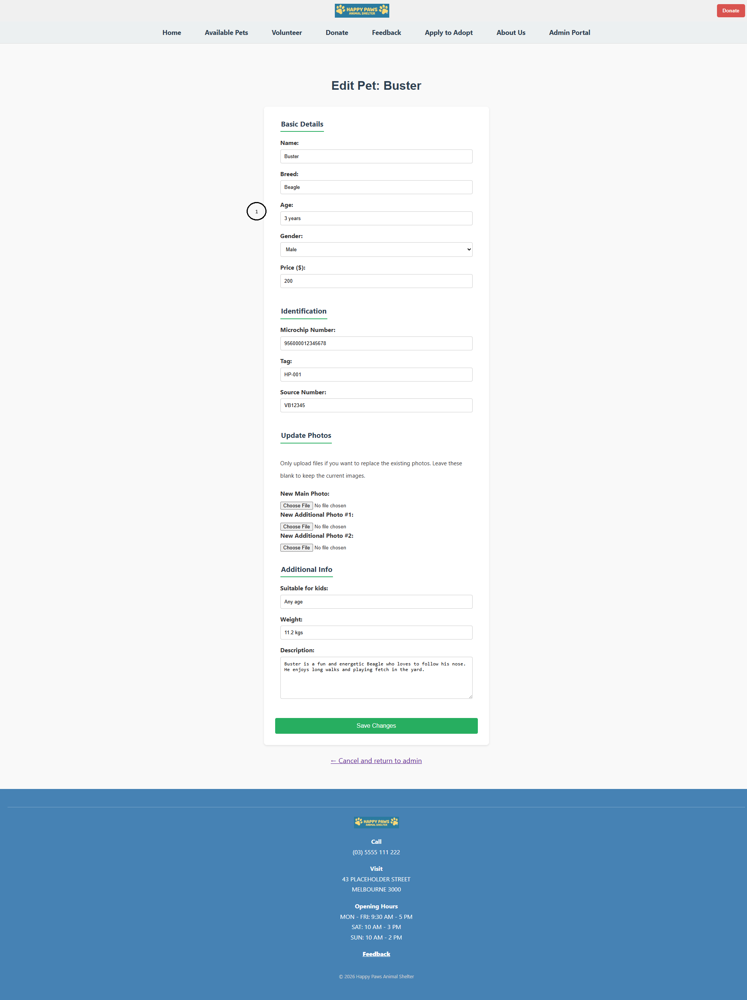

**Annotations:**
1. **Edit Pet information:** When editing a pet, you do not want to make a mistake by altering traits or fields that do not need to be touched. Therefore I made the decision to have every field pre-filled with the existing values to make it more straight forward, and from there the admin can decide on which areas need altering. On top of that, the name of the current pet being edited is displayed at the top.

---

## 2. Back-end Communication
*Details on how the server-side logic handles dynamic content generation.*

* **Technology Stack:** PHP 8.x and JSON-based data storage.
* **Implementation:** The volunteer roles and pet profiles are not hard-coded. Instead, a PHP `include` fetches data from the `data/` directory.
* **Code Logic:** > Using a `foreach` loop, the site iterates through the data array to populate the `.pet-card` components. This allows for horizontal scaling; as the shelter grows, new roles populate automatically without manual HTML edits.
* **Form Processing & File Management:** Administrative actions (adding/editing pets) use POST requests to transmit multipart form data. The server-side PHP handles unique file renaming (using timestamps) and dynamically updates the JSON database without overwriting existing data.

---

## 3. Style Guide Summary
*A reference for the visual brand identity applied across the A2 deployment.*

| Element | Value / Description |
| :--- | :--- |
| **Primary Color** | `#2c3e50` (Deep Navy - Trust & Professionalism) |
| **Secondary Color** | `#5dade2` (Sky Blue - Friendly & Approachable) |
| **Accent Color** | `#e67e22` (Orange - Interaction/Hover States) |
| **Typography** | Sans-serif (Segoe UI, Arial) for accessibility. |
| **UI Components** | Cards use an 8px border-radius with subtle box-shadows. |

---

## 4. Reflection
The transition from the initial static design to a more functional dynamic prototype was a really useful learning process. At first, the Happy Paws layout was built using hardcoded HTML and CSS, which made it easier to quickly test how the site looked and felt. However, it became clear that this approach wouldn’t scale well once more pets or features were added. Moving to a PHP and JSON-based system meant I had to rethink how the site was structured, separating the content (data) from the layout. This made the site much easier to manage because new pets could be added or updated without having to manually change the HTML each time. I still ended up hardcoding a small portion of the website which in a real life non-assignment scenario I would not have done so.

The most challenging part of the project was building the admin features, especially the “Add Pet” and “Edit Pet” functionality. Handling image uploads correctly, making sure filenames didn’t clash, and keeping the JSON file in sync with the changes required a lot of testing and debugging. A key focus was making sure that existing pet information wasn’t accidentally overwritten when edits were made, which meant carefully checking what data was already there before saving updates.

There were also a few practical issues when moving the project into a working server environment. One common problem was file paths not always working correctly depending on where the script was running from, which sometimes caused images or data not to load properly. I also had to make sure the server had permission to save uploaded images into the correct folder. On top of that, I added basic login protection to the admin area so that only authorised users could access it. Solving these issues helped make the site more reliable and closer to a real-world working system. The admin portal also came with issues where adding or editing pets caused a dilemma because I had to find a way to be able to actively add or edit new photos into a brand new animal which was the toughest part. Thankfully I was able to partially copy and paste what I had done in Modules 8 and 9 plus my other .php files which allowed me to find a way to get it done. 

---

## Appendix A – AI Usage

### Prompt
"Now how do I fix the issue where, when I open a page (im on codespaces), some images never load. Its random each time. I dont want my teacher to have issues with this."

### AI Response (excerpt)
"Stop your server (Ctrl + C) and restart it with multi-worker support:

PHP_CLI_SERVER_WORKERS=4 php -S 0.0.0.0:8000

That spins up 4 worker processes so requests can be handled in parallel."

### Prompt
"Is there an appropriate method that I skipped to fix the search bar in adoption.php? I have a filter list. I need to make the filter work as well as currently it's partially bugged and I haven't been able to debug it."

### AI Response (excerpt)
Suggested converting the search container into a GET form and updating filter inputs:

- Changed:
  `
`
  to
  `<form action="adoption.php" method="GET" class="search-container">`

- Added:
  `name="search"` and
  `value="<?= htmlspecialchars($searchTerm) ?>"`

- Changed search button:
  `type="button"` → `type="submit"`

- Updated checkbox names:
  `name="color"` → `name="color[]"`

- Changed Apply Filters button:
  `type="button"` → `type="submit"`

- Updated closing tag from `
` to `</form>`

### Prompt
"How can I add a simple Clear Filters button and make the volunteer search bar/buttons match the centered layout and size used on index.html?"

### AI Response (excerpt)
Suggested:
- Adding a `.filter-buttons` container with both an Apply Filters and Clear All button
- Styling the buttons with Flexbox for centered alignment
- Creating a transparent outlined style for the Clear Filters button
- Updating the volunteer search bar CSS to match the homepage search layout and sizing

### Prompt
"How do I add 2 extra vertical images per pet under the buttons and above the footer, with spacing and CSS? Also what image size should I use?"

### AI Response (excerpt)

1. Add extra images to `pets.json`

For each pet, add an `extraImages` array:

Example:
{
  "id": 1,
  "name": "Jolly",
  "image": "cat1.png",
  "extraImages": ["jolly_extra1.png", "jolly_extra2.png"]
}

If no images exist, use `[]` or omit the field.

---

2. Update `pet-details.php`

Add this below the buttons section:

<?php if (!empty($pet['extraImages']) && is_array($pet['extraImages'])): ?>
  

    <?php foreach ($pet['extraImages'] as $extraImg): ?>
      <!--!-->
    <?php endforeach; ?>
  

<?php endif; ?>

---

3. Add CSS

.pet-extra-images {
  display: flex;
  justify-content: center;
  gap: 2.5rem;
  margin: 3rem auto;
}

.pet-extra-img {
  width: 220px;
  height: 320px;
  object-fit: cover;
  border-radius: 8px;
}

---

Recommended image size:
- Display: 220 × 320 px  
- Actual upload size: ~440 × 640 px (for sharp rendering on high-DPI screens)

 

## 5. Appendix B: GitHub Activity Log

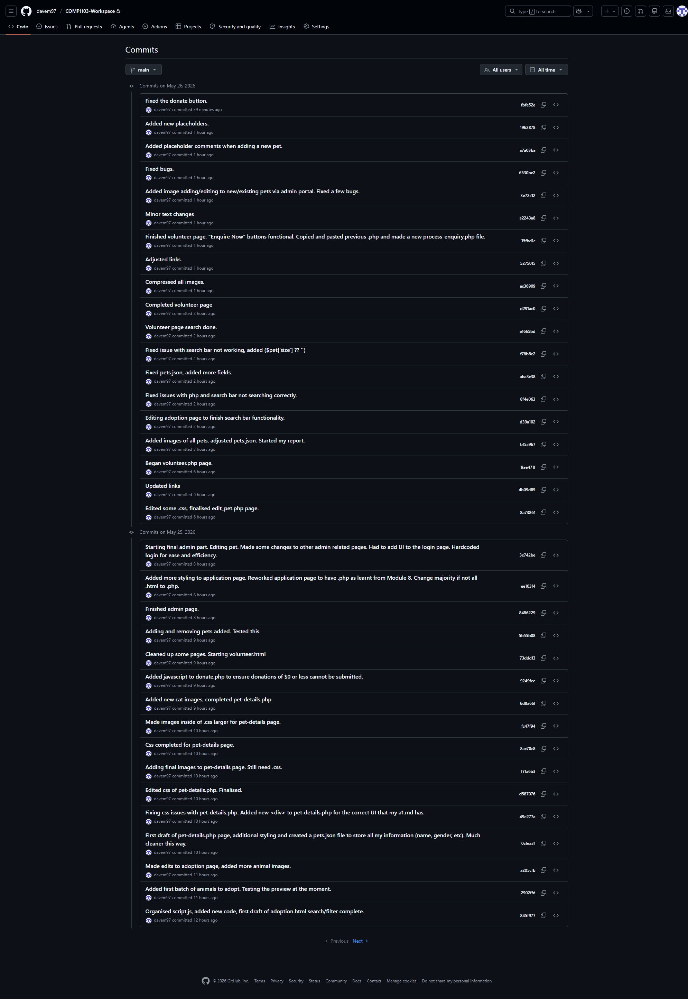

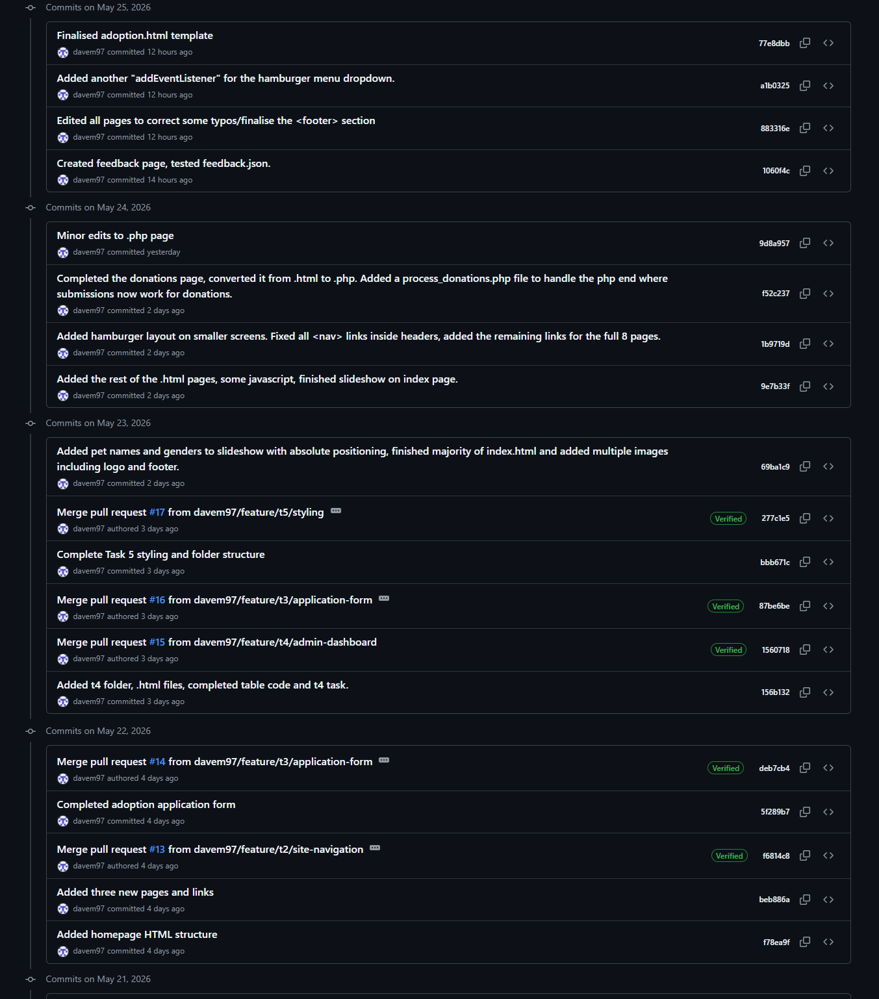

## 6. References

* Dimterion (2023) Images slider with JavaScript, Medium, accessed 21 May 2026, https://medium.com/@dimterion/images-slider-with-javascript-95349e0ab4fc
* MDN contributors (2026) <nav>: The Navigation Section element, MDN Web Docs, last modified 24 April 2026, accessed 22 May 2026, https://developer.mozilla.org/en-US/docs/Web/HTML/Reference/Elements/nav
* W3Schools n.d., How to create a responsive top navigation, W3Schools, accessed 25 May 2026, https://www.w3schools.com/howto/howto_js_topnav_responsive.asp
* Clark, G (2024) JavaScript — if, else, & else if statements, Medium, accessed 25 May 2026, https://geraldclarkaudio.medium.com/javascript-if-else-else-if-statements-26d18456f304
* Sabya (2025) Create a mobile toggle navigation menu using HTML, CSS, and JavaScript, GeeksforGeeks, last updated 3 November 2025, accessed 23 May 2026, https://www.geeksforgeeks.org/javascript/create-a-mobile-toggle-navigation-menu-using-html-css-and-javascript/
* Programiz n.d., JavaScript if...else statement, viewed 25 May 2026, https://www.programiz.com/javascript/if-else
* Nikhil 2025, How to remove hash from window location with JavaScript without page refresh, GeeksforGeeks, viewed 26 May 2026, https://www.geeksforgeeks.org/javascript/how-to-remove-hash-from-window-location-with-javascript-without-page-refresh/
* The Postman Team 2025, GET vs POST: Understanding HTTP Request Methods, Postman Blog, viewed 20 May 2026, https://blog.postman.com/get-vs-post/
* Mukesh Kumar 2025, HTTP Get Method and Post Method, upGrad Tutorials, viewed 24 May 2026, https://www.upgrad.com/tutorials/software-engineering/jquery-tutorial/http-get-and-post-methods/
* PHP Documentation Group n.d., Arrays, PHP Manual, viewed 25 May 2026, https://www.php.net/manual/en/language.types.array.php
* Anthropic 2026, Claude AI (May 2026 version), large language model, viewed 22-25 May 2026, https://claude.com/