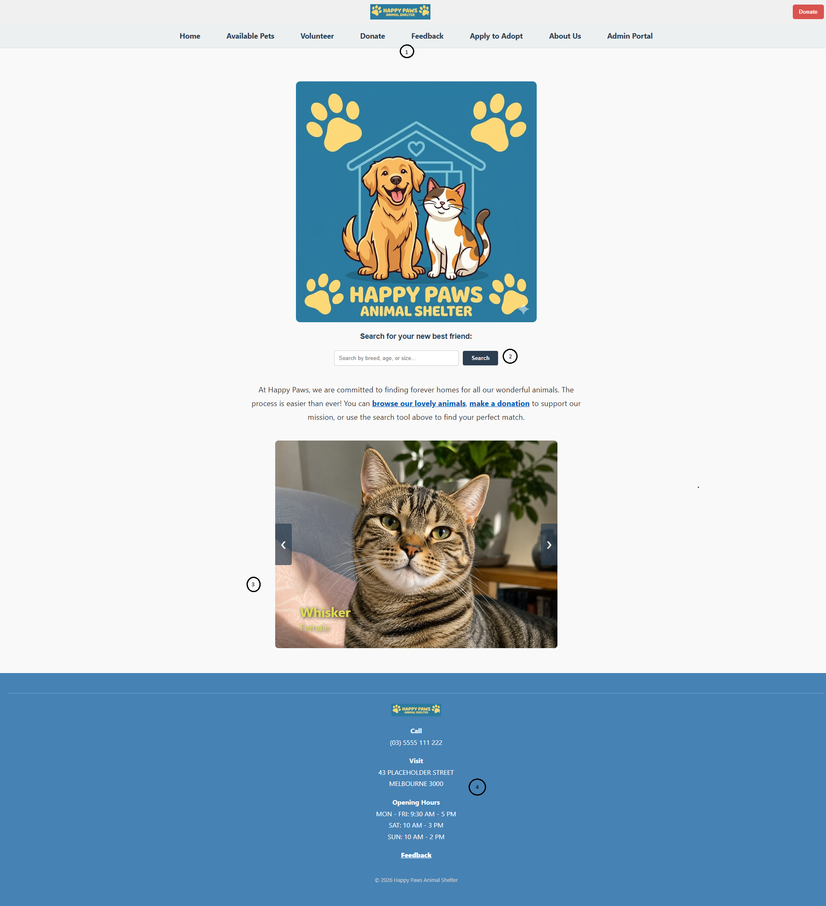

# Implementation Report: Happy Paws Animal Shelter
**Author:** David Matic (mati0046)  
**Date:** May 2026  
**Directory:** project-docs/src/A2/

---

## 1. Website Functionality & Flow
*Demonstrating the interactive features and user journey of the Happy Paws platform.*

### 1.1 Home Page (`index.php`)
The home page features a responsive hero section and a dynamic JavaScript slideshow.


**Annotations:**
1. **Horizontal Menu** The reason for this menu style is because it brings simplicity to the website and with the users attention being directly at the center where the logo is, it creates ease of use. 
2. **Search Bar** Large, accessible search bar to solve the user's primary intent immediately right inbetween all the content.
3. **Slideshow** This slideshow is meant to show some of the animals that the shelter have. They can be searched for directly above in the search bar, or via the "Available Pets" menu option.
4. **Vertically stacked footer** This is a very clean and clear way to handle all of the relevant information respective to the shelter; their phone number, address, etc. It is a common approach, brings an additional layer to the website and takes up some space. 

### 1.2 Volunteer Opportunities (`volunteer.php`)
This page provides a clear hierarchy of information regarding shelter support roles.

* **Annotation:** Layout is structured using CSS Flexbox. The "Our Purpose" boxes utilize rounded borders (20px) and a light blue brand accent to improve visual warmth.

---

## 2. Back-end Communication
*Details on how the server-side logic handles dynamic content generation.*

* **Technology Stack:** PHP 8.x and JSON-based data storage.
* **Implementation:** The volunteer roles and pet profiles are not hard-coded. Instead, a PHP `include` fetches data from the `data/` directory.
* **Code Logic:** > Using a `foreach` loop, the site iterates through the data array to populate the `.pet-card` components. This allows for horizontal scaling; as the shelter grows, new roles populate automatically without manual HTML edits.

---

## 3. Style Guide Summary
*A reference for the visual brand identity applied across the A2 deployment.*

| Element | Value / Description |
| :--- | :--- |
| **Primary Color** | `#2c3e50` (Deep Navy - Trust & Professionalism) |
| **Secondary Color** | `#5dade2` (Sky Blue - Friendly & Approachable) |
| **Accent Color** | `#e67e22` (Orange - Interaction/Hover States) |
| **Typography** | Sans-serif (Segoe UI, Arial) for accessibility. |
| **UI Components** | Cards use an 8px border-radius with subtle box-shadows. |

---

## 4. Reflection
*A 300-word analysis of the design-to-prototype journey.*

---

## 5. Appendix: GitHub Activity Log
*Chronological record of the development process.*

```text
[Paste my 'git log --oneline' output here]