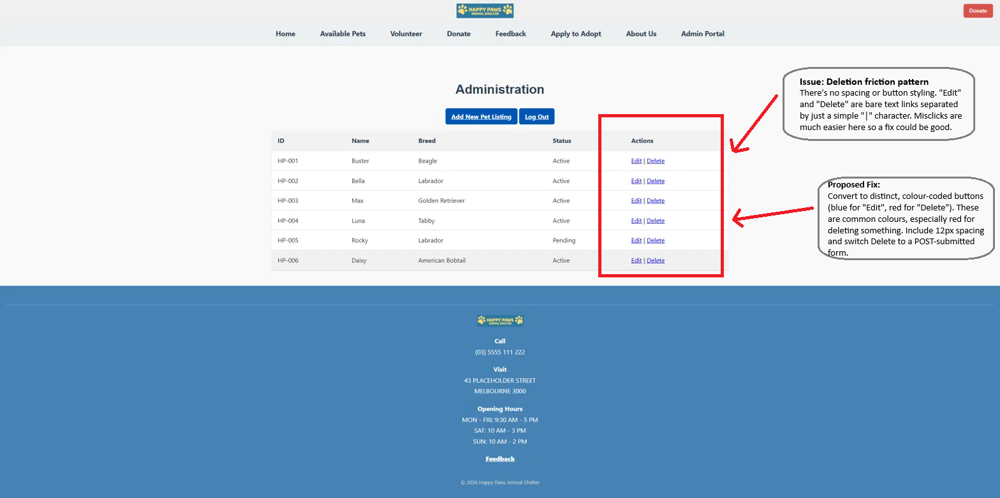
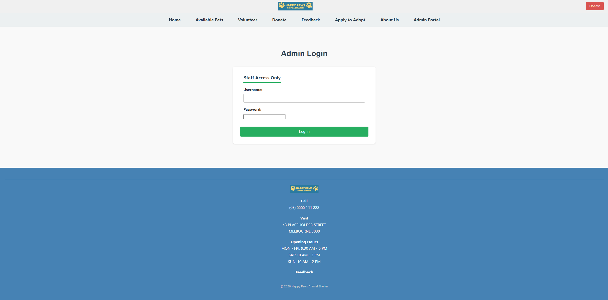

# Assignment 3: UX Evaluation Report

- **Author**: David Matic
- **FAN**: mati0046
- **Student ID**: 2376989

## Usability Testing and Prototyping

### Usability Test Plan

#### Clear Objectives
The primary objective of this testing process is to evaluate the full-stack performance, data state consistency, and user friction points of the Happy Paws Animal Shelter web application across two primary operational roles: public adopters and backend administrators. Testing aims to systematically expose interface flaws, navigation blind spots, and layout barriers. For the most part, testing should result in some findings.

#### Test Participants
A within-subjects design was used, with task order counterbalanced between participants to avoid order and learning effects:
* **Participant 1 (Adopter Flow First):** Age 21, high digital literacy, zero domain experience with administrative panels. Represents an everyday consumer looking through public pet directories.
* **Participant 2 (Admin Flow First):** Age 24, with moderate digital literacy, basic volunteering experience. Represents incoming shelter staff managing database states under particular time constraints.

#### Core Testing Tasks
* **Task 1 (Front-End Search & Apply):** Access the public site, navigate to `adoption.php`, use directory listings to identify a pet profile, and navigate to `application.php` to execute a front-end submission.
* **Task 2 (Back-End Authentication & CRUD):** Open `admin.php`, input the staff credentials, verify successful backend session initialization (`$_SESSION['logged_in']`), locate the dynamic directory table reading from `data/pets.json`, navigate to `add_pet.php` to insert a profile (**Create**), read active entries (**Read**), trigger `edit_pet.php` (**Update**), and execute a deletion script request wrapper (**Delete**).

#### Methodology and Apparatus
Testing was limited  to 15 minutes per session to maintain cognitive performance. The evaluation apparatus pipeline that was used:
1.  **Pre-Test Demographics Survey:** Establishing baseline tech proficiency and background.
2.  **Think-Aloud Protocol:** Capturing immediate qualitative cognitive reflections and verbalized pain points.
3.  **Single Ease Question (SEQ):** A 7-point Likert scale administered immediately following each task flow to pinpoint real-time spikes in interaction friction.
4.  **System Usability Scale (SUS):** A standardized 10-item, 5-point alternating-tone scale completed post-session, adapted to utilize the noun *"website"* to evaluate cumulative platform satisfaction.
5.  **Direct Observation:** Screen recordings and live observer note-taking were used throughout each session to log task completion time, misclicks, and navigation errors.

---

### Usability Testing Summary and Data Analysis

#### Testing Session Matrix
The quantitative data gathered during the experimental trials indicates clear differences in friction between the front-end user experience and backend administrative state changes. Data was captured through direct observation, think-aloud commentary, and structured post-task and post-session instruments, generating both quantitative performance metrics and qualitative behavioural insight.

| Metric Tracker | Participant 1 ( Adopter $\rightarrow$ Adm in) | Participant 2 (Admin $\rightarrow$ Adopter) | Average / Composite |
| :--- | :---: | :---: | :---: |
| **Task 1: Completion Time** | 1m 14s | 0m 52s | **1m 03s** |
| **Task 1: Error/Misclick Count** | 0 | 1 | **0.5 Errors** |
| **Task1: SEQ Rating (1-7)** | 7 | 6 | **6.5 (Very Easy)** |
| **Task 2: Completion Time** | 3m 42s | 2m 55s | **3m 18s** |
| **Task 2: Error/Misclick Count** | 4 | 2 | **3.0 Errors** |
| **Task 2: SEQ Rating (1-7)** | 3 | 4 | **3.5 (Difficult)** |
| **Final System Usability Scale Score** | 62.5 | 67.5 | **65.0 (Composite Score)** |

#### Qualitative Findings & Behavioral Trends
During the execution of **Task 1 (Front-End)**, both participants interacted with the primary navigation elements. Verbalized feedback through the think-aloud protocol was highly positive, highlighting intuitive content grouping.

However, **Task 2 (Backend Admin)** introduced substantial behavioral hesitation. Both users encountered a severe bottleneck during the entry point phase:
> **Participant 1 Note:** *"I can see the 'Admin Portal' link in the top menu navigation structure, but once I land on the login page, the different layout shift makes me feel like I have left the main place entirely."*

When going through and interacting  with the system configuration panel, both participants experienced a bit of operational delays on the main `admin.php` control layout page:
* **Visual Noise:** The raw structural layout of the HTML table containing data rows from `pets.json` lacked explicit visual grouping or pagination boundaries.
* **The Deletion Friction Pattern:** When attempting to clean up records, both users hesitated significantly when clicking the dynamic text-based "Delete" link. The proximity of the plain text "Edit" and "Delete" triggers inside the actions table header resulted in accidental misclicks, logging a high error count.

#### SUS Score Evaluation & Academic Justification
After applying the standard mathematical calculations for alternating-tone surveys, the composite platform evaluations registered a **System Usability Scale score of 65.0**. Benchmarked against the generally accepted threshold of 70 for an acceptable system, this score places Happy Paws in the "marginal" usability range — adequate for the front-end adopter experience, but pulled down considerably by friction encountered during backend administrative tasks.

#### Issue Prioritisation
Of the issues identified, the **Deletion Friction Pattern** is prioritised as the most significant usability concern requiring change. This is because of three separate reasons: (1) **Frequency** — both participants, regardless of task order, made misclicks on this control which sort of shows a structural design flaw rather than individual error. (2) **Severity** — unlike most interface friction, an accidental deletion is a destructive for any website (or non-website), difficult-to-reverse action with immediate consequences for shelter record-keeping. (3) **Quantitative Impact** — Task 2 recorded the highest error count (3.0 avg) and lowest SEQ rating (3.5, "Difficult") of the entire session, with the Edit/Delete proximity issue directly implicated in participant think-aloud commentary. This combination of consistency, consequence, and measurable impact differentiates it from lower-stakes issues such as the visual noise in the table layout, which, while noted, did not produce nearly as many error rates, so that is why those three were chosen, for the most part.

#### Iteration Description

Based on the prioritised Deletion Friction Pattern, three changes are proposed across the front-end and back-end. **HTML**: the Edit and Delete actions are reworked so Delete is no longer a bare hyperlink but a distinct button inside its own form, each given a unique class (`action-edit`, `action-delete`). **CSS**: a new `.action-cell` rule rule  introduces consistent spacing (12px gap) and colour-coded styling — blue for Edit, red for Delete — increasing both the size and separation of each clickable target. This directly applies **Fitts's Law**, which predicts that selection speed and accuracy improve as target size increases and distance between competing targets increases. **PHP**: `delete_pet.php` is updated to accept the pet ID via `$_POST` rather than `$_GET`, removing the ability for a destructive action to be triggered by a simple link click, pre-fetch, or accidental navigation — addressing both the usability risk and a security/data-integrity concern. Together, these changes target the exact mechanism behind the high Task 2 error rate and lowest SEQ score recorded during testing. Originally, the default "Delete" and "Edit" simple links where there for just that, simplicity. But on a website that is full of styling, leaving the admin page quite empty and plain was not the way to go, especially when the layout of the entire website should generally be the same throughout. Having for example 5 pages look similar while the 6th is completely different and almost "unfinished" looking, could perhaps send messages that maybe the website/shelter is not up-to-par. 

**Proposed HTML (admin.php):**
```html
<td class="action-cell">
  <a href="edit_pet.php?id=<?= $pet['id'] ?>" class="action-btn action-edit">Edit</a>
  <form action="scripts/delete_pet.php" method="POST" class="inline-delete-form"
        onsubmit="return confirm('Are you sure you want to remove this pet?')">
    <input type="hidden" name="id" value="<?= $pet['id'] ?>">
    <button type="submit" class="action-btn action-delete">Delete</button>
  </form>
</td>
```

**Proposed CSS (styles/style.css):**
```css
.action-cell {
  display: flex;
  gap: 12px;
  align-items: center;
}

.action-btn {
  display: inline-block;
  padding: 6px 14px;
  border-radius: 4px;
  font-weight: bold;
  font-size: 0.85rem;
  text-decoration: none;
  border: none;
  cursor: pointer;
}

.action-edit { background-color: #0056b3; color: white; }
.action-delete { background-color: #d9534f; color: white; }
.inline-delete-form { display: inline-block; margin: 0; }
```

**Proposed PHP (scripts/delete_pet.php):**
```php
$idToDelete = isset($_POST['id']) ? (int)$_POST['id'] : 0;
```

**Annotated Screenshot:**



### Appendix

#### A. Moderator Script
**Greeting:** "Thank you for volunteering your time today. We're testing the Happy Paws Animal Shelter website to see how easily people can use it, both as a public visitor and as a shelter administrator. There are no wrong answers — -if something is confusing or difficult, that's exactly the feedback we need. Please think aloud as you go: tell me what you're looking at, what you expect to happen, and how you feel about it."

**Pre-Test:** Participant completes the demographics questionnaire (see Section B).

**Instructions:** "I'll give you two short tasks. Please complete them as you normally would. I'll ask you a quick question after each one, and a longer survey at the very end."

**During Test:** Observer records completion time, errors, and verbal commentary for each task (see Section D). The SEQ (Section b) is administered immediately after each task.

**Debrief:** "that's everything — thank you. The SUS questionnaire (Section B) will take about two minutes. Do you have any final comments about your experience?" Participant is thanked and the session is closed.

---

#### B. Survey and Interview Questions

**Pre-Test Demographics Questionnaire**
1. What is your age?
2. On a scale of 1–5, how would you rate your general digital/computer literacy?
3. Have you used a website's admin/back-end panel before (e.g. content management systems)?
4. Do you have any prior experience with animal shelters or volunteering?

**Single Ease Question (SEQ)** — administered after each task:
> "Overall, this task was: Very difficult (1) — Very easy (7)"

**System Usability Scale (SUS)** — administered once, after all tasks, with "system" replaced by "website":
1. I think that I would like to use this website frequently
2. I found the website unnecessarily complex
3. I thought the website was easy to use
4. I think that I would need the support of a technical person to be able to use this website
5. I found the various functions in this website were well integrated
6. I thought there was too much inconsistency in this website
7. I would imagine that most people would learn to use this website very quickly
8. I found the website very cumbersome to use
9. I felt very confident using the website
10. I needed to learn a lot of things before I could get going with this website

---

#### C. Task Descriptions (as presented to participants)
**Task 1:** "Imagine you are a member of the public looking to adopt a pet. Find a pet you like the look of on the website, and complete an adoption application for it."

**Task 2:** "You are now a Happy Paws staff member. Log in to the Admin Portal using the credentials provided, add a new pet listing, edit an existing pet's details, and then remove a pet listing that is no longer needed."

---

#### D. Think-Aloud Transcript Excerpts

**Participant 1 — Task 1:** "Tthis is pretty clear, I can see the pets straight away... I'll click on this one... okay, applying looks simple enough, yeah."

**Participant 1 — Task 2:** "I can see the 'Admin Portal' link in the top menu navigation part of the website, but once I land on the login page, the different sort of layout shift makes me feel like I have left the main application entirely." *(logs in)* "Okay, I want to delete this one... wait, I almost clicked Edit instead, they're right next to each other."

**Participant 2 — Task 1:** "yep, found the pet I want, the form's pretty straightforward."

**Participant 2 — Task 2:** *( after logging in)* "This table's a lot to take in at once... trying to delete this entry now... yeah see, nearly hit Edit again. These two need more space between them."

---

#### E. Data Captured

| Metric Tracker | Participant 1 ( Adopter $\rightarrow$ Adm in) | Participant 2 (Admin $\rightarrow$ Adopter) | Average / Composite |
| :--- | :---: | :---: | :---: |
| **Task 1: Completion Time** | 1m 14s | 0m 52s | **1m 03s** |
| **Task 1: Error/Misclick Count** | 0 | 1 | **0.5 Errors** |
| **Task1: SEQ Rating (1-7)** | 7 | 6 | **6.5 (Very Easy)** |
| **Task 2: Completion Time** | 3m 42s | 2m 55s | **3m 18s** |
| **Task 2: Error/Misclick Count** | 4 | 2 | **3.0 Errors** |
| **Task 2: SEQ Rating (1-7)** | 3 | 4 | **3.5 (Difficult)** |
| **Final System Usability Scale Score** | 62.5 | 67.5 | **65.0 (Composite Score)** |

#### F. Supporting Observational Data

**Admin Login Page** — illustrates the layout-shift concern raised by Participant 1:


**Admin Table View (Annotated)** — see annotated screenshot in the Iteration Description section above, which illustrates the Deletion Friction Pattern referenced in this evaluation.